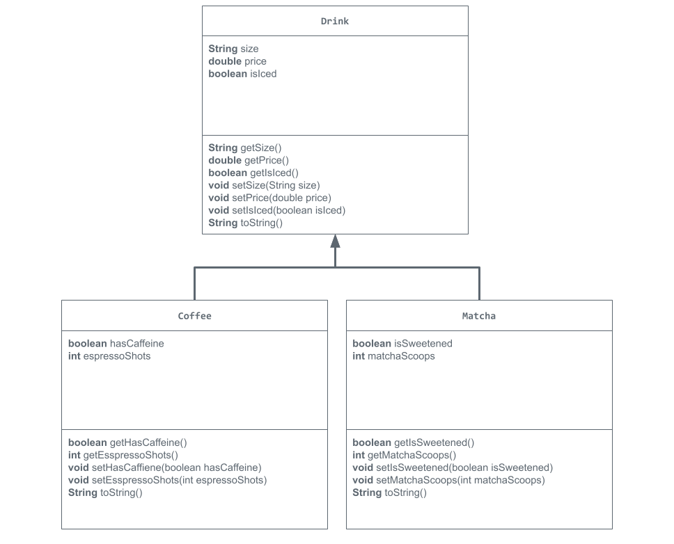

# store-management-project
My project for Unit 2 APCSA
# Unit 2 - Store Management Project

## Introduction

You are opening a new business in your community! Businesses often need programs to manage the products and services they offer and track orders and requests from customers. Your goal is to create a store management system for your business.

## Requirements

Use your knowledge of object-oriented programming and class structure and design to create your store management system:
- **Create a class hierarchy** – Develop a superclass that represents a product or service your business offers and one or more subclasses that extend the superclass to represent more specific types of products or services.
- **Declare instance variables** – Declare instance variables in the superclass that are shared with the subclasses and instance variables in the subclasses that are not shared with the superclass.
- **Write constructors** – Write no-argument and parameterized constructors in the superclass and subclasses. Subclass constructors use the super keyword to call the superclass constructor.
- **Implement accessor and mutator methods** – Write accessor and mutator methods for instance variables that should be accessible and/or modifiable from outside of the class.
- **Implement a toString() method** – Write toString() methods in the superclass and subclasses that return information about the state of an object.

## UML Diagram

Put and image of your UML Diagram here. Upload the image of your UML Diagram to your repository, then use the Markdown syntax to insert your image here.

## Description
I made a cafe, where the superclass is a drink and the subclasses are a coffee and a matcha. I chose to do a cafe and sell coffee and matcha because I enjoy going to cafes to try new coffee and matcha. In the superclass, there were three instance variables, size, price, and whether the drink is iced or not. The size is a String, price is a double, and whether the drink is iced or not is a boolean. In the each of subclasses, there were two instance variables, one boolean and one int. For the coffee subclass, the boolean was whether the coffee is caffeinated or not and the int is the number of espresso shots in the cofee. For the matcha subclass, the boolean was whether or not the matcha was sweetened and the int was the number of matcha scoops in the drink. Each class has a constructor method, one no argument (to set the default values) and one parameterized. For the the drink and matcha class, I used the this keyword, but for the coffee class, I did not use the this keyword. Also, I created accessor and mutator methods to use later in the scanner class, and I created a toString method for each class to be able to print out all the values at once. 

In the StoreRunner, the scanner class was used. In the beginning, default values are printed out using the toString method. However, after the toString method, the program asks the user a series of questions about their coffee and their matcha, and then prints out all the information for each drink. The program acts as a barista/cashier taking the user's order. Because all outputs may not fit what the program is intended to look for, I made it so that the program asks the question, and gave choices for the user to pick from. This will cause less errors in the code and allow the code to run until the end. 